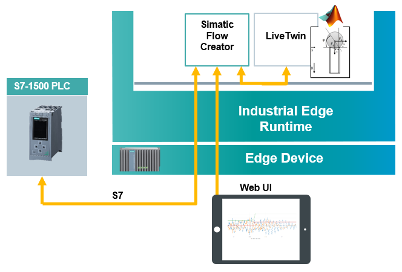

# Simulating virtual sensor with LiveTwin

Running a simulation model on the edge device using the Siemens app LiveTwin. 

- [Simulating virtual sensor with LiveTwin](#simulating-virtual-sensor-with-livetwin)
  - [Description](#description)
    - [Overview](#overview)
    - [General task](#general-task)
  - [Requirements](#requirements)
    - [Prerequisities](#prerequisities)
    - [Used components](#used-components)
  - [Installation steps](#installation-steps)
  - [Documentation](#documentation)
  - [Contribution](#contribution)
  - [Licence & Legal Information](#licence--legal-information)

## Description

###  Overview
This application example shows how to export a Simulink virtual sensor model and run it on an Industrial Edge Device with the LiveTwin application. The model can read data from a PLC and send the current status back to the PLC. 

### General task
The main goal of this automation task is to create a Simulink model that simulates a shock sensor, export it to the required format and run it on the Industrial Edge Device using LiveTwin. The Industrial Edge Device can read data from the PLC simulating vibrations via  SIMATIC Flow Creator application using the S7 communication protocol. The model can evaluate whether the vibrations have occurred and send the current shock status back to the PLC. The data flow can be visualized by using the SIMATIC Flow Creator application.

## Requirements

###  Prerequisities

- Onboarded Industrial Edge Device on IEM
- Installed system configurators
- Installed Industrial Edge System Applications applications
- Installed LiveTwin and SIMATIC Flow Creator applications
- Industrial Edge Device is connected to the PLC 
- TIA portal project downloaded to the PLC ([TIA project](src/Shock_detection1500.zip))

### Used components

- Industrial Edge Device V 1.2.0-56
- PLC: CPU 1511
- TIA Portal V16 
- Matlab 2019b
- SIMATIC Flow Creator V 1.0.5
- Livetwin V1.1.4

## Installation steps
You can find the further information about the following steps in the [docs](docs/Installation.md)
- Export Simulink model 
- Import the model to LiveTwin  
  - Create instance
  - Create SIMATIC Flow Creator project
- Configure the SIMATIC Flow Creator project properties
- Run the simulation 
  - Visualize the data 
  - Send shock status back to PLC

## Documentation
- Here is a link to the [docs](docs/) of this application example.
- You can find further documentation and help in the following links
  - [Industrial Edge Hub](https://iehub.eu1.edge.siemens.cloud/#/documentation)
  - [Industrial Edge Forum](https://www.siemens.com/industrial-edge-forum)
  - [Industrial Edge landing page](https://new.siemens.com/global/en/products/automation/topic-areas/industrial-edge/simatic-edge.html)
  
## Contribution

Thank you for your interest in contributing. Anybody is free to report bugs, unclear documentation, and other problems regarding this repository in the Issues section.
Additionally everybody is free to propose any changes to this repository using Pull Requests.

If you haven't previously signed the [Siemens Contributor License Agreement](https://cla-assistant.io/industrial-edge/) (CLA), the system will automatically prompt you to do so when you submit your Pull Request. This can be conveniently done through the CLA Assistant's online platform. Once the CLA is signed, your Pull Request will automatically be cleared and made ready for merging if all other test stages succeed.

## Licence & Legal Information
Please read the [Legal information](LICENSE.md)
